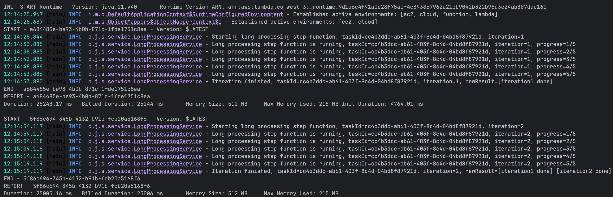

# kotlin-step-function

It's a simple backend to test Kotlin + serverless capabilities with AWS Step Functions.
It has to be easy to develop locally and to deploy in a convenient way.
It can compile both to:
- the native GraalVM executable (longer build, faster cold start)
- JAR with JVM runtime (faster build, slower cold start)


## How does it work?

1. `POST /async-tasks`, response:
    ```json
    {
        "taskId": "29f878f0-3266-4f87-a796-e96642246a5a",
        "executionArn": "arn:aws:states:eu-west-3:250158618739:execution:longProcessingWorkflow:29f878f0-3266-4f87-a796-e96642246a5a",
        "status": "RUNNING"
    }
    ```
2. `GET /async-tasks/29f878f0-3266-4f87-a796-e96642246a5a`, response:
    ```json
    {
        "taskId": "29f878f0-3266-4f87-a796-e96642246a5a",
        "executionArn": "arn:aws:states:eu-west-3:250158618739:execution:longProcessingWorkflow:29f878f0-3266-4f87-a796-e96642246a5a",
        "status": "RUNNING"
    }
    ```
   ...wait a bit for the processing. It's set to 2x invocations for 25s each
3. The same GET response later:
    ```json
    {
        "taskId": "29f878f0-3266-4f87-a796-e96642246a5a",
        "executionArn": "arn:aws:states:eu-west-3:250158618739:execution:longProcessingWorkflow:29f878f0-3266-4f87-a796-e96642246a5a",
        "status": "SUCCEEDED",
        "result": "[iteration1 done] [iteration2 done]"
    }
    ```
Under the hood:
- The POST request started a step function workflow from Lambda
- The 1st step received `iteration: 1` value, slept 5x for 5s and set `"[iteration1 done]"` in the result
- The 2nd step received `iteration: 2` value (the 1st step incremented it in its output), sleep and added `" [iteration2 done]"` to the result (see the logs below)
- The approach is stateless, the UUID passed is also the step function execution ID, so it allows to get the current state by that on GET request

Logs screenshot from the step function execution:


## Prerequisites

- Java 21 or higher
- Docker installed and running (for the native image)
- AWS CLI configured with appropriate credentials
- Serverless Framework CLI installed globally: `npm install -g serverless` or use `npx serverless`

## Option 1: Native with GraalVM

To build the GraalVM native image (zip file), use `./gradlew buildNativeLambda`. Then, you can deploy it with
serverless.

#### One command build + deployment

Build a zipped native executable (using Docker) and deploy with `--param runtimeType=native` (change or remove `--aws-profile` if needed):
```bash
./gradlew buildNativeLambda && \
  serverless deploy --param runtimeType=native --aws-profile dev
```

## Option 2: Standard JAR Deployment (JVM runtime)

Build a Kotlin application JAR and deploy with `--param runtimeType=jvm` (change or remove `--aws-profile` if needed):
```bash
./gradlew build && \
  serverless deploy --param runtimeType=jvm --aws-profile dev
```

## Local development

### Option 1: Run with Gradle CLI
```shell
./gradlew runLocal
```

### Option 2: Run/debug with IntelliJ
Just go with Intellij to `LocalApp` file and click "play" button on the main function.
It's a simple way to have a debugger.
